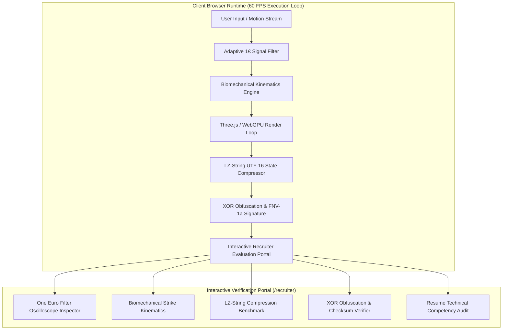

# Ink of the Forgotten Path

**Browser-Native 3D Martial Arts Action Engine & Recruiter Evaluation Portal**

[](https://www.npmjs.com/package/ink-of-the-forgotten-path)
[](LICENSE)
[](https://nextjs.org/)
[](https://threejs.org/)
[](https://www.typescriptlang.org/)

---

## Overview

Ink of the Forgotten Path is a high-performance browser-native 3D martial arts action game engineered with Next.js 16, TypeScript, and Three.js WebGPU/WebGL rendering pipelines. It features dynamic sword and dragon mount aerial combat, custom ink-wash aesthetic particle post-processing, real-time biomechanical strike physics, and an adaptive One Euro Filter signal processing pipeline for touch and motion input smoothing.

### Official NPM Package

The core mathematical engine, signal processing filters, biomechanical physics models, and interactive evaluation portal are published as a tree-shakable NPM library:

```bash
npm install ink-of-the-forgotten-path
```

- Live Demo: [ink-of-the-forgotten-path.animatrous.com](https://ink-of-the-forgotten-path.animatrous.com/)
- NPM Registry: [npmjs.com/package/ink-of-the-forgotten-path](https://www.npmjs.com/package/ink-of-the-forgotten-path)
- NPM Library Repository: [github.com/code-dibyajyotirout/ink-of-the-forgotten-path-npm-package](https://github.com/code-dibyajyotirout/ink-of-the-forgotten-path-npm-package)
- Distributed Fullstack Monorepo: [github.com/code-dibyajyotirout/ink-of-the-forgotten-path-fullstack](https://github.com/code-dibyajyotirout/ink-of-the-forgotten-path-fullstack)

---

## Architectural Dataflow



---

## Interactive Recruiter Evaluation Portal

The web application includes a dedicated technical verification portal at `/recruiter` designed for hiring managers and technical interviewers to evaluate and audit core algorithms in real time:

1. **Signal Processing Inspector**: Live canvas oscilloscope contrasting noisy input coordinates against One Euro Filter smoothed output with real-time parameter tuning (`minCutoff`, `beta`, `dCutoff`).
2. **Biomechanical Kinematics Engine**: Real-time evaluation of punch velocity in m/s, acceleration in m/s², and kinetic force in Newtons across strike archetypes.
3. **LZ-String Compression Benchmark**: In-browser UTF-16 compression benchmark measuring uncompressed vs compressed payload sizes (40-60% footprint reduction).
4. **XOR Bitwise Obfuscation Inspector**: Demonstrates browser credential masking and 32-bit FNV-1a integrity checksum verification.
5. **Resume Competency Matrix**: Line-by-line verification checklist mapping every engineering bullet point from the resume to its corresponding module.

---

## Quick Start

### Prerequisites
- Node.js 18.19.0 or higher
- npm 9.0.0 or higher

### Installation & Local Development

```bash
# Clone the repository
git clone https://github.com/code-dibyajyotirout/ink-of-the-forgotten-path.git
cd ink-of-the-forgotten-path

# Install dependencies
npm install

# Start development server
npm run dev
```

Open [http://localhost:3000](http://localhost:3000) to launch the game, or navigate to [http://localhost:3000/recruiter](http://localhost:3000/recruiter) for the evaluation portal.

### Build Production Bundle

```bash
npm run build
npm start
```

---

## Repositories & Ecosystem

| Component | Repository Link |
| :--- | :--- |
| **Frontend Application** | [github.com/code-dibyajyotirout/ink-of-the-forgotten-path](https://github.com/code-dibyajyotirout/ink-of-the-forgotten-path) |
| **NPM Package Library** | [github.com/code-dibyajyotirout/ink-of-the-forgotten-path-npm-package](https://github.com/code-dibyajyotirout/ink-of-the-forgotten-path-npm-package) |
| **Distributed Fullstack Monorepo** | [github.com/code-dibyajyotirout/ink-of-the-forgotten-path-fullstack](https://github.com/code-dibyajyotirout/ink-of-the-forgotten-path-fullstack) |
| **Published NPM Package** | [npmjs.com/package/ink-of-the-forgotten-path](https://www.npmjs.com/package/ink-of-the-forgotten-path) |

---

## License

This project is licensed under the GNU Affero General Public License v3.0 ([LICENSE](LICENSE)).
